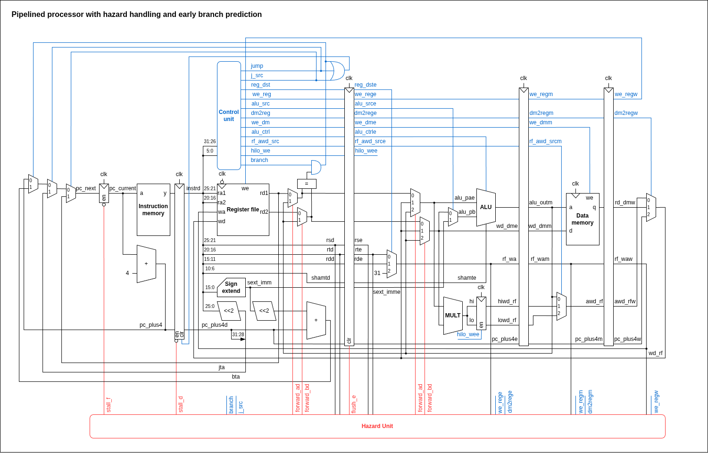
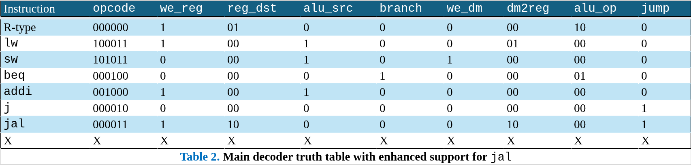

# MIPS Pipelined Processor

This is a pipelined MIPS processor written in SystemVerilog. The processor implements a [Hennesy & Patterson-style](https://www.d.umn.edu/~gshute/mips/MIPS.html) MIPS RISC instruction set architecture. Only a limited instruction set is currently supported. Simulation was done using Xilinx Vivado 2025.2 and validation was done using the Basys3 FPGA board.

## Features

* 5-stage pipelined MIPS-like CPU
* Static branch prediction (not-taken)
* Early branch resolution (ID stage)
* Forwarding + stall/flush logic for data and control hazards
* Memory-mapped peripherals (GPIO + factorial accelerator)
* FPGA-ready SoC wrapper (imem/dmem + addr decoder)
* Supports `lw`, `sw`, `beq`, `addi`, `j`, `jal`, `add`, `sub`, `and`, `or`, `slt`, `sll`, `srl`, `multu`, `mfhi`, `mflo`, and `jr`.

## Architecture

| Stage | Key signals computed                | Main hazards relevant |
| ----- | ----------------------------------- | --------------------- |
| IF    | imem access                         | branch/jr stall/flush |
| ID    | decode, branch compare, jump target | branch/jr stall/flush |
| EX    | ALU result, shift, mult/hi-lo write | EX forwarding         |
| MEM   | dmem access                         | load-use              |
| WB    | reg writeback mux                   | —                     |






See `doc/` for more diagrams.

## How to Run

*Prerequite: Make sure you've installed [Vivado](https://docs.amd.com/r/en-US/ug910-vivado-getting-started/Installing-the-Vivado-Design-Suite).*

1. Create a new Vivado project (select the Basys3 part: `xc7a35tcpg236-1`).
2. Add all `.sv` files under `pkg/` and `rtl/` as **Design Sources**.
3. Copy a test program from `sim/tests/` (or `sim/programs/`) into the project root as `imem.hex`.
   ```bash
   cp sim/tests/00-addi_add.hex imem.hex
   ```
  * You can also generate your own `imem.hex` file (I used MARS MIPS Compiler).
4. Add `imem.hex` to the project as a **Design Source**.
5. Add `sim/tb_mips_soc.sv` as a **Simulation Source**.
6. Add `constraints/mips_fpga.xdc` and/or `constraints/mips_debounced_fpga.xdc` as **Constraint Sources**.
  * Make sure you only enable the one that matches the top-level you’re building.
7. Simulation:
   1. Set `tb_mips_soc` as the **Simulation Top**.
   2. Run **Behavioral Simulation**.
8. Program Basys3 (hardware validation):
   1. Plug in the Basys3.
   2. Set the correct **Top Module** (your FPGA top) and the matching `.xdc`.
   3. Run **Implementation** → **Generate Bitstream**.
   4. Open **Hardware Manager** → **Auto Connect** → **Program Device**.

## Documentation / Diagrams

The `doc/` directory contains:

* block diagrams
* decoder truth tables (main + auxiliary)
* memory map tables (SoC + GPIO + factorial)

## Contributions

Contributions are welcome! Please follow the existing coding style and naming conventions if submitting changes.
